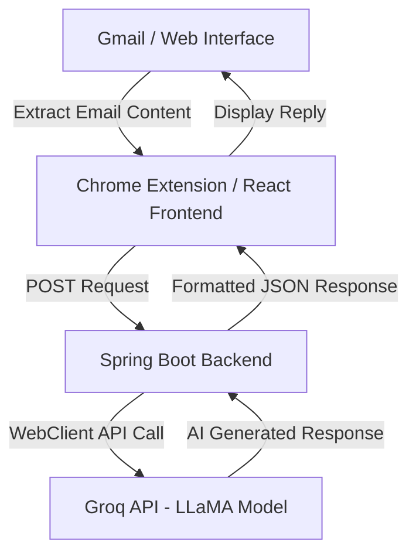

# 📧 AI Email Assistant

### AI-Powered Email Reply Generator | Full Stack + Chrome Extension

---

# 🎥 Demo Video

<p align="center">
  <a href="https://drive.google.com/file/d/18l4yhQr-nfdEHnBAoP8OO9-9yKH3Gb77/view?usp=sharing">
    
  </a>
</p>
<p align="center">
  📌 Click the image above to watch the full demo
</p>

---

# 📸 Project Preview

## 🏠 Main Dashboard
<p align="center">
  
</p>

---

## ✨ AI Generated Reply
<p align="center">
  
</p>

---

## 🧩 Chrome Extension Integration
<p align="center">
  
</p>

---

# 🚀 Why This Project Matters

The average professional spends hours managing emails every week.

This project solves three major problems:

### ⚡ Decision Fatigue

No more staring at a blank screen wondering how to reply.

### 🎯 Tone Inconsistency

Generate replies in the perfect tone:

* Professional
* Friendly
* Formal
* Confident
* Concise
* Persuasive

### 🔄 Workflow Friction

Integrates directly into Gmail using a Chrome Extension for a seamless experience.

---

# ✨ Key Features

## ⚡ Smart AI Reply Generator

* Context-aware email understanding
* Human-like response generation
* Fast inference using Groq LLMs
* Natural conversational replies

---

## 🎯 Tone Control System

Users can instantly generate emails with different tones:

* Professional
* Friendly
* Formal
* Confident
* Concise
* Persuasive
* Supportive
* Apologetic

---

## 🧠 Action-Based AI Features

Beyond replies, the assistant also supports:

| Action          | Description                 |
| --------------- | --------------------------- |
| Reply           | Generate contextual replies |
| Summarize       | Summarize long emails       |
| Improve Writing | Refine existing drafts      |
| Shorten         | Make emails concise         |
| Expand          | Add more detail             |
| Grammar Fix     | Correct grammar mistakes    |

---

## 🌐 Chrome Extension Support

### DOM Injection

Injects an AI Reply button directly into Gmail.

### Floating AI Popup

Custom popup UI using Material UI.

### MutationObserver Integration

Detects dynamic Gmail compose windows in real-time.

---

# 🧱 System Architecture



---

# 🛠️ Tech Stack

| Component | Technology                   |
| --------- | ---------------------------- |
| Frontend  | React.js, Material UI, Axios |
| Backend   | Spring Boot, WebClient       |
| AI Engine | Groq API (LLaMA Models)      |
| Extension | JavaScript, Manifest v3      |
| Animation | React TypeAnimation          |
| Parsing   | Jackson JSON                 |
| Styling   | Material UI                  |

---

# 🧠 How It Works

## 1️⃣ Email Extraction

The Chrome Extension extracts email content directly from Gmail using:

* MutationObserver
* DOM traversal
* Dynamic compose detection

---

## 2️⃣ Request Payload

The frontend sends a structured payload to the backend:

```json
{
  "emailContent": "Can we reschedule our meeting to 3 PM?",
  "tone": "Professional",
  "action": "Reply"
}
```

---

## 3️⃣ Prompt Engineering

The backend constructs a specialized AI prompt to ensure:

* concise replies
* natural writing
* proper tone handling
* professional formatting

---

## 4️⃣ AI Response Generation

Groq API processes the request using LLaMA models and returns a generated response instantly.

---

# 🔐 Security Features

## ✅ API Key Protection

* Secrets stored securely in environment variables
* No API keys exposed to frontend
* Backend acts as secure gateway

---

## ✅ Production Safety

* Error handling implemented
* Input trimming and validation
* Safe API response parsing

---

# ⚙️ Setup Instructions

# 1️⃣ Clone Repository

```bash
git clone https://github.com/YOUR_USERNAME/email-ai-assistant.git
cd email-ai-assistant
```

---

# 2️⃣ Backend Setup (Spring Boot)

```bash
cd backend
```

Create:

```properties
application.properties
```

Add:

```properties
server.port=8082

groq.api.url=https://api.groq.com/openai/v1/chat/completions
groq.api.key=YOUR_GROQ_API_KEY
groq.model=llama-3.1-8b-instant
```

Run backend:

```bash
./mvnw spring-boot:run
```

---

# 3️⃣ Frontend Setup (React)

```bash
cd frontend

npm install

npm run dev
```

---

# 4️⃣ Chrome Extension Setup

1. Open Chrome
2. Navigate to:

```text
chrome://extensions/
```

3. Enable Developer Mode
4. Click "Load unpacked"
5. Select extension folder

---

# 📌 Future Roadmap

* [ ] Multi-language Support
* [ ] AI Tone Detection
* [ ] Authentication System
* [ ] Email History
* [ ] Export to PDF
* [ ] Cloud Deployment
* [ ] Docker Support
* [ ] AI Prompt Templates
* [ ] Team Collaboration Features

---

# ⭐ What Makes This Project Stand Out

This project demonstrates:

✅ Real-world AI integration
✅ Full Stack Development
✅ Prompt Engineering
✅ Chrome Extension Development
✅ API Security Practices
✅ DOM Manipulation Engineering
✅ Production-Level Debugging
✅ Responsive UI Design
✅ AI-Powered Productivity Tooling

---

# 🧪 Challenges Solved

During development, several real-world engineering issues were handled:

* API model deprecation
* GitHub secret scanning protection
* Backend request validation
* Frontend/backend synchronization
* Port conflicts
* API error tracing
* Prompt reliability improvements

---

# 📊 Performance Goals

* ⚡ Fast AI response generation
* 🎯 Accurate contextual replies
* 🧠 Natural human-like output
* 🌐 Smooth browser integration

---

# 👨‍💻 Author

## Prijith John

Full Stack Developer passionate about:

* AI-powered applications
* Productivity systems
* Web engineering
* Scalable backend systems

---

# 📬 Connect With Me

<p align="left">
  <a href="https://github.com/prijithjohn">GitHub</a> •
  <a href="https://www.linkedin.com/in/prijith-john-dev">LinkedIn</a>
</p>

---


# ⭐ Support

If you found this project useful, consider giving it a ⭐ on GitHub.
